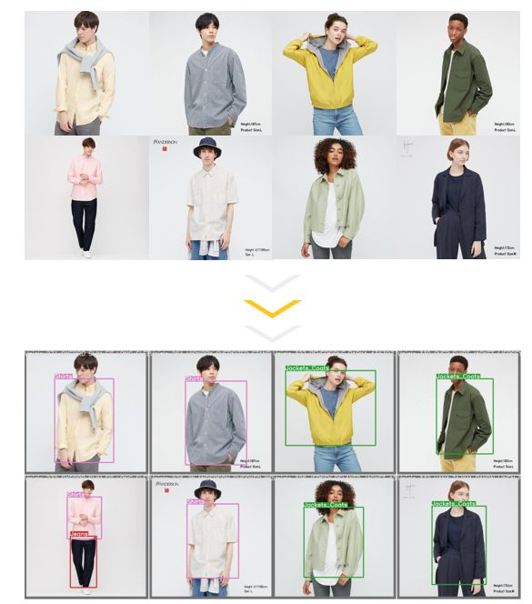
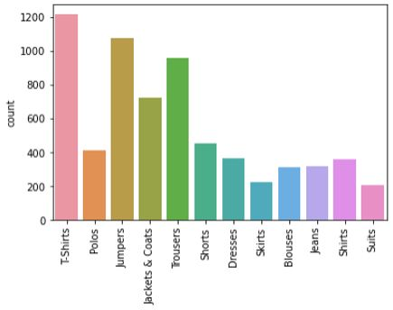
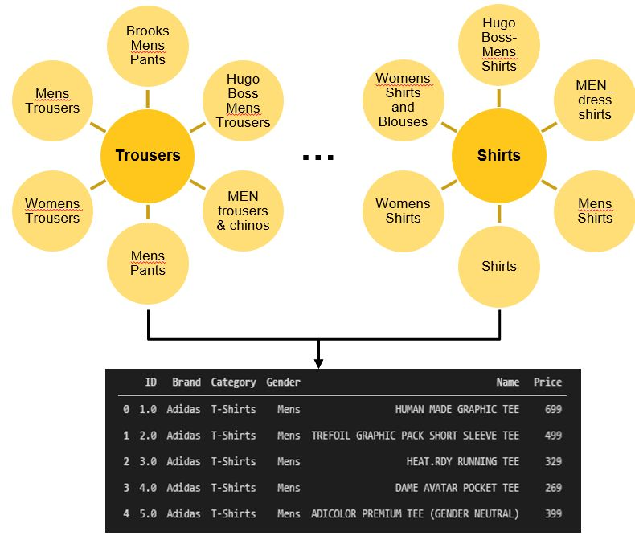
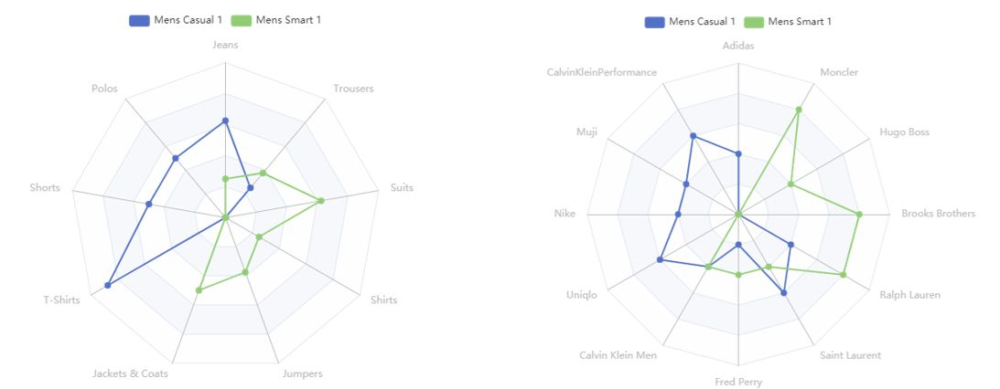

### Project Goals:

ShopRec is a **Computer Vision recommendation system**, used for in store personalised clothing recommendations.

ShopRec aims to **personalise** customer retail shopping experience, and revitalise in-store shopping.

- Undiscovered Opportunity:
  * Lack of multi brand / shop recommendation systems.
  * Gap in the market for computer vision.
- Multiple Benefits: 
  * Customers, Shops and Shopping Centres will all benefit from innovation.

### Business Case:

- Customers:
  * Personalised recommendations based on their shopping preferences.
  * Tailored vouchers and discount offers to spend in store.
- Shops:
  * Maintain and enhance customer loyalty.
  * Attract customers from complementary / partner stores.
- Shopping Centres:
  * Opportunities to attract more footfall by offering unique experiences
  * Increase synergy across complementary stores.

### Model Overview:

### Model Development:

####1. Webscraping:
- 1a. Webscraping:
 * Clothing images scraped from various retailers e.g. Nike, Ralph Lauren, Uniqlo, Calvin Klein, Max & Co, for a diverse range of male/female clothing styles. 
- 1b. Image Labeling:
 * Images were stored, bounding boxes were drawn to label categories for use in model training.

- 1c. Product and Shops
 * 12 categories of clothing, 13 stores, c. 6000 images in total.

####2. Data Processing:
2a. Product Database:
 * Webscraped data was cleaned e.g. similar clothing types were mapped to a consistent category
 * All scraped images were saved in a product database, with characteristics recorded (e.g. brand name, clothing type, gender).

2b. User Shopping History Generation:
 * Multiple shopping personas were created to represent the distribution of clothing items purchased by customers. An example of “Men’s Casual” and “Men’s Smart” personas are      shown below.
 * E.g. a user could shop at 50% Nike, 30% Uniqlo, 20% Fred Perry, and buying 60% T-shirts, 20% trousers, 20% jumpers.
 * User histories were generated using these shopping profiles and sampling the product database based on the product/shop weights. Deviations were included to prevent              overfitting to the original shopping profiles.

####3. Model Training:
- 3a. Overview:
 * Yolov5 was used to train our image detection model, after several iterations the final model parameters were:
 * Model: Yolov5L
 * Train/Test/Val: 80/10/10
 * Epochs: 30
 * Batch size: 16
- 3b. Model Training Process:
 * Data preparation
 * Prepare project folder structure
 * Define ‘YAML’ files to specify: location of data, names and number of classes
 * Run model training
 * Export weights for later use
- 3c. Confusion Matrix:
 * Total average precision: 69%, recall: 73%
 * Confusion Matrix shows all categories generally predict well

- 3d. F1 Curve
 * The F1 curve shows the F1 score across different confidence levels, i.e. the Precision / Recall trade off in our model.
 * Using a 42% confidence for predictions in our model would give the best F1 score of 69%.

####4. Recommendation System:
- 4a. Nearest Neighbours:
 * For user with known shopping histories, Product and Shop weightings were calculated based on Product and Shop weights.

 * Product weighting measures the proportion of each clothing type purchased; Shop weightings measures the proportion of clothes purchased at each shop.

 * Nearest Neighbours were found based on Euclidean distance to both these weightings. A static distance matrix of the distance between all known users was calculated and          stored, which allowed faster calculations of nearest neighbours.

 * For illustration, User 1 and 193 are nearest neighbours as they both have very similar Product and Shop profiles.

- 4b. Recommendations:
   Once nearest neighbours are established for a user, the recommendation system works as follows:

   All items bought by nearest neighbours are pooled together
   Items already purchased by the user are removed
   Products bought by nearest neighbours are ranked and recommended based on popularity.

   Users are also able to filter their recommendation e.g. by specific stores, and/or by product type.

####5. Deployment
5a. Streamlit:
 * A proof of concept app was deployed in Streamlit due to ease of implementation.
 * This demonstrates functionality of image detection and recommendation system

### Future Enhancements:
- Feature Extractions:

 * Enhance image recognition model to detect and recognise clothing features e.g. style, patterns. 

 * Initial analysis shows common features across similar items.

- Expand Data and Product Range:
 * Add more stores to broaden inventory. Include accessories and non-fashion items.

 * Combine with real life consumer data.

- Refine Deployment:

 * Include additional user interface features e.g. rewards scheme, user login, customer product ratings, links to websites

 * Consider use Django, Kivy, pyQT to deploy app.

